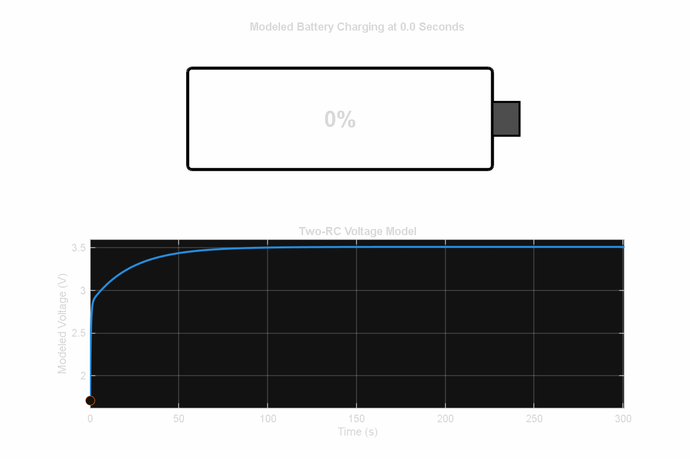
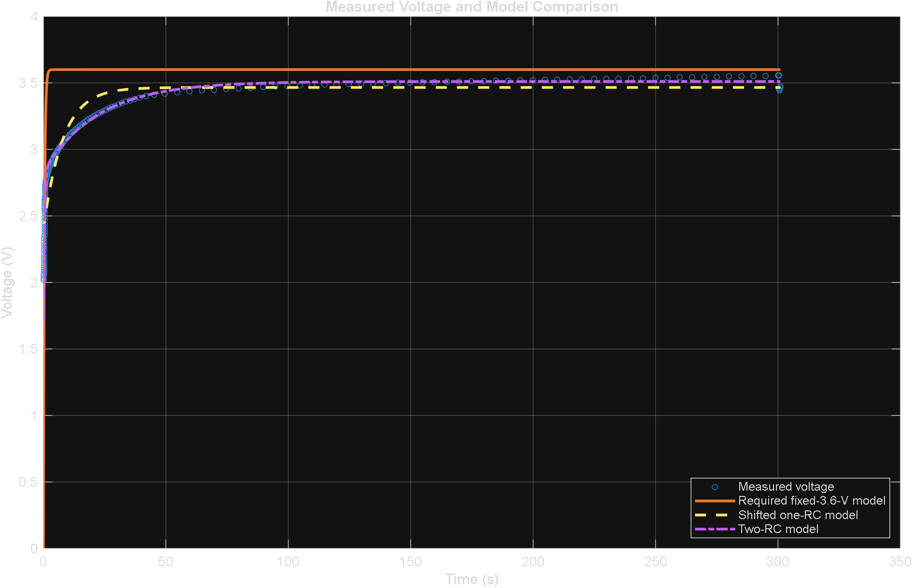
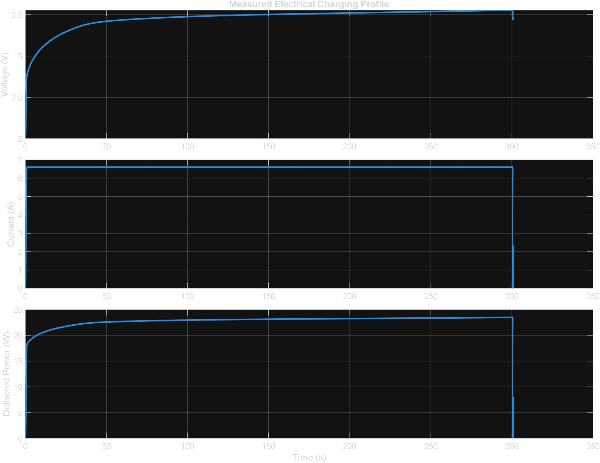
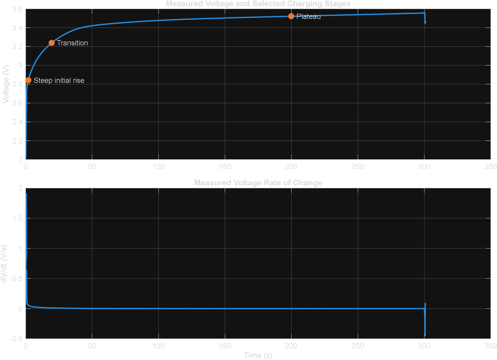

# Battery Charging Analysis Using MATLAB

**Team:** BatteryProfile.Team6  
**Program:** Engineering Pathway Program  
**Instructor:** Kevin Graham  
**Submission Deadline:** August 6, 2026  



## Project Overview

This project uses MATLAB to analyze a measured lithium-ion battery charging profile from Cycle 1 of the MathWorks battery lifetime dataset.

The first 301 seconds of Cycle 1 are used to model the measured voltage response. The required fixed-3.6-volt one-RC model is presented as the assignment baseline and compared with a shifted one-RC model and a two-RC model.

The analysis includes:

- Measured voltage and current
- Electrical power
- Voltage rate of change
- Charging-time estimates
- Delivered energy
- Internal resistive energy loss
- Model validation
- Comparison with calculations reported by Sa and Maya
- A battery GIF that fills according to the fitted voltage response

## Team Members and Roles

| Team Member | Role |
|---|---|
| Yovany Gaspar | Project Manager and QA/Reproducibility Lead |
| Sa Nguyen | Modeling Lead |
| Maya Maestas | Analysis and Validation Lead |
| Kailey Neri | Documentation and Visualization Lead |

## Project Objectives

The objectives of this project were to:

1. Import and inspect the battery lifetime dataset.
2. Select Cycle 1 from the complete dataset.
3. Reset the selected cycle so time begins at zero seconds.
4. Isolate the first 301 seconds of the charging interval.
5. Plot measured voltage, current, and power.
6. Fit the required fixed-3.6-volt one-RC model.
7. Report the fitted time constant, R-squared value, and RMSE.
8. Compare the required model with shifted one-RC and two-RC models.
9. Calculate the measured voltage rate of change.
10. Estimate required-model and measured charging times.
11. Calculate delivered energy using numerical integration.
12. Estimate resistive energy loss using the internal-resistance measurements.
13. Validate the MATLAB results against the calculations reported by Sa and Maya.
14. Export the final figures, CSV tables, report, and battery animation.

## Dataset

The project uses the MathWorks battery dataset:

```text
singleCellLifeTimeData.mat
```

The complete dataset contains measurements from multiple battery charging and discharging cycles.

### Main Variables

| Variable | Description | Unit |
|---|---|---|
| `DateTime` | Recorded measurement time | Converted to seconds |
| `Test_Time` | Elapsed testing time | Seconds |
| `Cycle_Index` | Battery-cycle number | Unitless |
| `Step_Index` | Testing-stage identifier | Unitless |
| `Voltage` | Measured battery-cell voltage | Volts |
| `Current` | Measured battery current | Amperes |
| `Internal_Resistance` | Measured battery internal resistance | Ohms |
| `Temperature` | Measured battery temperature | Degrees Celsius |

The final MATLAB code selects Cycle 1 using:

```matlab
cycleData = data(data.Cycle_Index == 1,:);
```

The cycle time is then reset so that the selected interval begins at zero seconds.

The dataset is stored in:

```text
data/singleCellLifeTimeData.mat
```

Because the MAT file is larger than GitHub’s browser-upload limit, it is stored using Git Large File Storage.

## Selected Charging Interval

The final analysis uses the first 301 seconds of Cycle 1:

```matlab
modelEnd_s = 301;

chargeData = cycleData( ...
    cycleData.Time_s <= modelEnd_s,:);
```

This interval matches the charging segment used in Sa’s analysis and allows the final MATLAB results to be compared directly with the team’s previous work.

## Analysis Methods

The MATLAB analysis follows these steps:

1. Load the complete battery dataset.
2. Confirm that the required variables are present.
3. Select Cycle 1.
4. Reset the selected cycle time to zero seconds.
5. Select the first 301 seconds.
6. Plot the measured voltage and current.
7. Fit the required fixed-3.6-V one-RC model.
8. Fit the shifted one-RC comparison model.
9. Fit the two-RC comparison model.
10. Compare each model using R-squared and RMSE.
11. Calculate measured electrical power.
12. Calculate the voltage rate of change using `gradient`.
13. Determine required-model and measured charging times.
14. Calculate delivered energy using `trapz`.
15. Calculate resistive energy loss using measured internal resistance.
16. Compare selected results with Sa’s and Maya’s reported values.
17. Export the final figures and CSV tables.
18. Create the optional battery-charging GIF.

## Voltage Models

### Required Fixed-3.6-V One-RC Model

The required model is:

$$
V(t)=V_{\max}\left(1-e^{-t/\tau}\right)
$$

where:

- \(V_{\max}=3.6\text{ V}\)
- \(\tau\) is the only fitted parameter

This equation assumes that the voltage begins at zero volts. The measured battery begins at a nonzero voltage, so the required model is retained as the assignment baseline even though it does not provide the strongest numerical fit.

### Shifted One-RC Model

The shifted model is:

$$
V(t)=V_0+A\left(1-e^{-t/\tau}\right)
$$

This model includes the nonzero starting voltage \(V_0\).

### Two-RC Model

The two-RC model is:

$$
V(t)=V_0+
A_1\left(1-e^{-t/\tau_1}\right)+
A_2\left(1-e^{-t/\tau_2}\right)
$$

The two time constants allow the model to represent a rapid initial response and a slower voltage response.

## Model-Fitting Results

| Model | Time Constant(s) | R-squared | RMSE |
|---|---:|---:|---:|
| Required fixed-3.6-V one-RC | \(\tau=0.3871\text{ s}\) | 0.2458 | 0.3854 V |
| Shifted one-RC | \(\tau=7.902\text{ s}\) | 0.9109 | 0.1332 V |
| Two-RC | \(\tau_1=0.4474\text{ s}\), \(\tau_2=22.51\text{ s}\) | 0.9913 | 0.0418 V |

The required model produced the weakest fit because it assumes an initial voltage of zero.

The shifted one-RC model improved the fit by accounting for the measured starting voltage.

The two-RC model produced the highest R-squared value and lowest RMSE. It was therefore the strongest numerical description of the measured voltage response. However, it also requires more fitted parameters and is kept as an additional comparison rather than a replacement for the required model.



## Voltage, Current, and Power

The project provides a voltage equation but does not provide a separate current-versus-time equation. Measured current values are therefore used for:

- The current plot
- The power calculation
- The delivered-energy calculation
- The resistive-loss calculation

Electrical power is calculated from corresponding measured samples:

$$
P(t)=V(t)I(t)
$$

The final voltage, current, and power figure is located at:

```text
results/figures/voltage_current_power.png
```



## Voltage Rate of Change

The measured voltage rate of change is calculated using MATLAB’s `gradient` function:

```matlab
voltageRate_V_per_s = gradient(voltageMeasured,x);
```

### Selected Voltage-Rate Results

| Time | Voltage Rate |
|---:|---:|
| Approximately 2 s | 0.058114 V/s |
| Approximately 20 s | 0.011477 V/s |
| Approximately 200 s | 0.00033329 V/s |

The voltage increased rapidly near the beginning of the selected interval and then gradually approached a plateau.



## Charging-Time Results

### Required-Model Time to 80 Percent

For the required exponential model, the time to reach 80 percent of the model maximum is:

$$
t_{80}=-\tau\ln(0.20)
$$

### Required-Model Practical Full Time

Five time constants are used as a mathematical approximation of practical full charge:

$$
t_{\text{practical}}=5\tau
$$

At five time constants, the exponential model reaches approximately 99.3 percent of its mathematical maximum.

### Charging-Time Summary

| Result | Value |
|---|---:|
| Required-model time to 80% | 0.6230 s |
| Required-model practical full time | 1.9354 s |
| Measured 80% rise threshold | 3.2476 V |
| Measured time to 80% rise | 20.4860 s |
| Maximum measured voltage | 3.5557 V |
| Time of maximum measured voltage | 300.4845 s |

The required-model times are mathematical baseline values. Because the required equation does not fit the measured data well, these values are not treated as realistic state-of-charge times.

The measured maximum-voltage time represents the highest voltage observed within the selected interval. It is not proof that the battery reached exactly 100 percent state of charge.

## Delivered Energy

Delivered energy is calculated by numerically integrating the measured electrical power:

```matlab
energyDelivered_J = trapz(x,powerDelivered_W);
energyDelivered_Wh = energyDelivered_J/3600;
```

### Delivered-Energy Results

| Unit | Value |
|---|---:|
| Joules | 6859.3 J |
| Watt-hours | 1.9054 Wh |

## Internal Resistive Energy Loss

Internal resistive power loss is calculated using:

$$
P_{\text{loss}}(t)=I(t)^2R(t)
$$

The primary calculation uses the time-varying internal-resistance measurements recorded in the dataset:

```matlab
resistivePowerLoss_W = ...
    currentMeasured.^2 .* resistanceUsed_Ohm;

resistiveEnergyLoss_J = ...
    trapz(x,resistivePowerLoss_W);
```

Invalid resistance values, when present, are replaced with the median valid resistance from the selected interval.

### Primary Resistive-Loss Results

| Result | Value |
|---|---:|
| Representative internal resistance | 0.017634 Ω |
| Resistive energy loss | 230.45 J |
| Resistive energy loss | 0.06401 Wh |
| Resistive loss as a percentage of delivered energy | Approximately 3.36% |

This result represents only the simplified internal \(I^2R\) loss included in the analysis. It should not be interpreted as the battery’s total charging efficiency because other thermal and electrochemical losses were not modeled.

Alternative resistance and loss methods from Sa and Maya are retained as separate validation comparisons. They produce different results because they use different definitions of battery resistance.

## Validation

The final MATLAB run was compared with the results reported by Sa and Maya.

The validation process checked:

- Shifted one-RC fitted coefficients
- Two-RC fitted coefficients
- R-squared values
- RMSE values
- Voltage-rate values
- Measured 80 percent rise threshold
- Measured 80 percent rise time
- Maximum measured voltage
- Time of maximum measured voltage
- Delivered energy
- Alternative resistance calculations
- Alternative resistive-loss calculations

The full analysis and validation record is located at:

```text
documentation/validation.md
```

The exported validation tables are located in:

```text
results/tables/
```

## Battery Animation

The optional MATLAB animation displays a battery image that fills according to the normalized two-RC modeled voltage response.

- The battery is yellow from 0 percent through 79 percent.
- The battery changes to green from 80 percent through 100 percent.
- The fill rate follows the normalized two-RC voltage response.
- A moving point follows the fitted voltage curve.
- The displayed percentage is normalized modeled-voltage progress.
- The percentage is not claimed to be the battery’s exact state of charge.

The GIF is located at:

```text
results/animations/battery_model_charging.gif
```


## Project Outputs

The final project includes:

- Cycle 1 voltage and current overview
- Required-model voltage fit
- Three-model voltage comparison
- Measured voltage, current, and power figure
- Voltage rate-of-change figure
- Model-comparison CSV table
- Voltage-rate CSV table
- Final summary-results CSV table
- Sa validation tables
- Maya validation table
- Derived-analysis table
- Final MATLAB Live Script
- Plain MATLAB code
- Final PDF report
- Battery-charging GIF
- Analysis and validation documentation
- Reproducibility test instructions

## Final MATLAB Files

- [MATLAB Live Script](live_script/BatteryProfile_Team6_Final.mlx)
- [Plain MATLAB Code](live_script/BatteryProfile_Team6_Final.m)
- [Final PDF Report](live_script/BatteryProfile_Team6_Final.pdf)

## Documentation

- [Analysis and Validation](documentation/validation.md)
- [Reproducibility Tests](tests/README.md)

## Repository Structure

```text
BatteryProfile.Team6/
├── .gitattributes
├── README.md
├── data/
│   └── singleCellLifeTimeData.mat
├── live_script/
│   ├── BatteryProfile_Team6_Final.mlx
│   ├── BatteryProfile_Team6_Final.m
│   └── BatteryProfile_Team6_Final.pdf
├── results/
│   ├── figures/
│   │   ├── cycle1_overview.png
│   │   ├── required_model_fit.png
│   │   ├── model_comparison.png
│   │   ├── voltage_current_power.png
│   │   └── voltage_rate_of_change.png
│   ├── tables/
│   │   ├── model_comparison.csv
│   │   ├── rate_of_change.csv
│   │   ├── summary_results.csv
│   │   ├── sa_model_validation.csv
│   │   ├── sa_raw_validation.csv
│   │   ├── maya_validation_comparison.csv
│   │   └── derived_analysis_metrics.csv
│   └── animations/
│       └── battery_model_charging.gif
├── documentation/
│   └── validation.md
└── tests/
    └── README.md
```

## Software Requirements

The project requires:

- MATLAB
- Curve Fitting Toolbox
- Git Large File Storage for cloning the full dataset

## Running the Project

1. Clone the repository with Git LFS enabled.
2. Confirm that the complete dataset is located at:

   ```text
   data/singleCellLifeTimeData.mat
   ```

3. Open the final MATLAB Live Script:

   ```text
   live_script/BatteryProfile_Team6_Final.mlx
   ```

4. Select **Run All**.
5. Choose `singleCellLifeTimeData.mat` when the file-selection window appears.
6. Review the numerical results and figures.
7. Confirm that the CSV tables were exported to `results/tables`.
8. Run the optional battery-animation section separately after the required analysis has completed.

## Downloading the Dataset Through MATLAB

The full dataset can also be downloaded directly from MathWorks:

```matlab
dataFile = matlab.internal.examples.downloadSupportFile( ...
    "predmaint", ...
    "batteryagingdata/singlecell/v1/" + ...
    "singleCellLifeTimeData.zip");

unzip(dataFile,"data")
```

After extraction, confirm that the file is located at:

```text
data/singleCellLifeTimeData.mat
```

## Assumptions

The final analysis assumes that:

- Cycle 1 provides an appropriate charging interval for model comparison.
- The selected interval ends at approximately 301 seconds.
- Positive current represents charging during the selected interval.
- The required model maximum voltage is fixed at 3.6 V.
- Five time constants provide only a mathematical approximation of practical full charge.
- Invalid resistance values can be replaced with the median valid resistance from the selected interval.
- The observed maximum voltage is not the same as an exact measurement of 100 percent state of charge.

## Limitations

The voltage models provide simplified descriptions of one selected battery-charging interval.

They do not independently model:

- Exact battery state of charge
- Battery temperature effects
- Battery capacity fade
- Battery aging
- Electrochemical reactions
- Hysteresis
- Complete charging-control behavior
- Battery-management-system operation

The two-RC model provides the strongest numerical fit, but its additional fitted parameters increase model complexity.

The internal-resistance calculation represents only a simplified resistive-loss estimate. It does not include every possible thermal or electrochemical loss.

The results are based on one cycle and one selected interval. They should not be generalized to every battery age, temperature, cycle, or charging condition without additional testing.

## Conclusion

The required fixed-3.6-volt one-RC model was completed as the official project baseline. Its low R-squared value and higher RMSE show that it does not accurately represent the selected charging interval because it assumes an initial voltage of zero.

The shifted one-RC model improved the fit by accounting for the measured starting voltage. The two-RC model produced the strongest numerical fit because it represented both the rapid initial voltage response and the slower approach to the voltage plateau.

Measured current was retained for the power and delivered-energy calculations because no independent current-versus-time equation was provided. The dataset’s internal-resistance measurements were used for the primary resistive-loss calculation.

The final repository includes the complete dataset, reproducible MATLAB analysis, fitted voltage models, exported figures, CSV tables, validation documentation, reproducibility instructions, and the battery-charging GIF.
